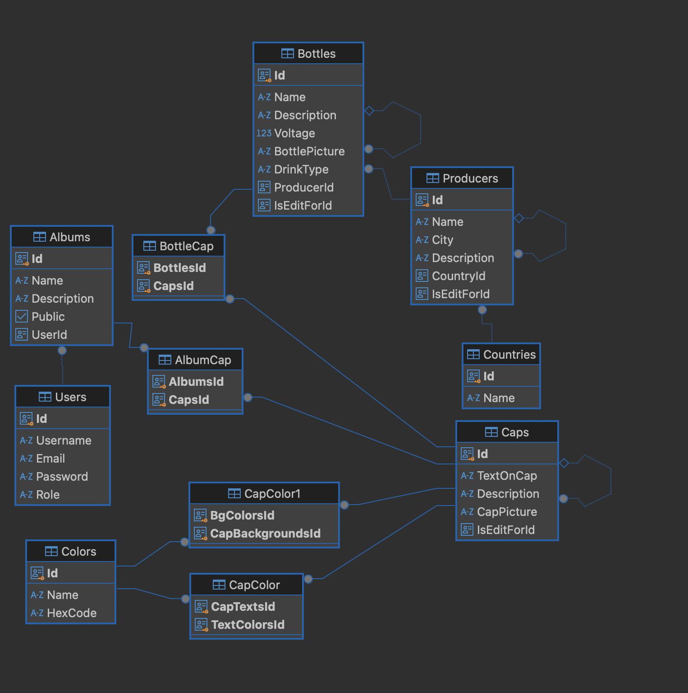
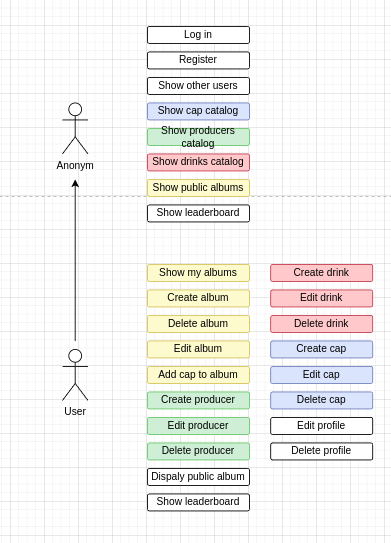

# PV179 - Beer cap collector

## Overview
Tento projekt je databází pro sběratele pivních víček, která slouží k tomu, aby si sběratel mohl ukládat své exponáty do virtuálního alba a získal lepší přehled o své sbírce. Umožňuje nejen základní správu sbírky, ale také pokročilé funkce, které usnadní rozhodování při pořizování nových přírůstků.

### Přehled funkcionalit
+ Virtuální album sbírky: Ukládání a správa jednotlivých pivních víček v digitální podobě.
+ Statistiky sbírky: Přehled o počtu víček, rozdělení podle zemí nebo značek.
+ Porovnání sbírek: Možnost porovnávat sbírky s ostatními sběrateli na platformě.
+ Vyhledávání víček: Rychlé vyhledávání podle barvy víčka nebo textu na něm, aby se sběratel mohl snadno zorientovat, zda už konkrétní víčko vlastní.

### Role
+ Uživatel: Spravuje svou sbírku, zobrazuje statistiky, využívá vyhledávání a porovnává svou sbírku s ostatními.
+ Admin: Spravuje platformu, přidává funkce, moderuje obsah a zajišťuje bezproblémový chod.

---

Tento projekt pomáhá sběratelům udržet přehled o jejich sbírce a zefektivnit jejich rozhodování při rozšiřování sbírky.


## Getting started

### Setup DB
Spuštění databáze
```
docker compose up
```

Vytvoření migrace, spuštění migrace
```
dotnet ef migrations add <nazev-migrace>
dotnet ef database update
```

### Setup projektu

Build a spuštění
```
dotnet build
dotnet run
```

Používej formatter před každým commitem. Jinak neprojde CR.

```
 dotnet format ../CapEnjoyer.sln
```
## Technický pohled



 


